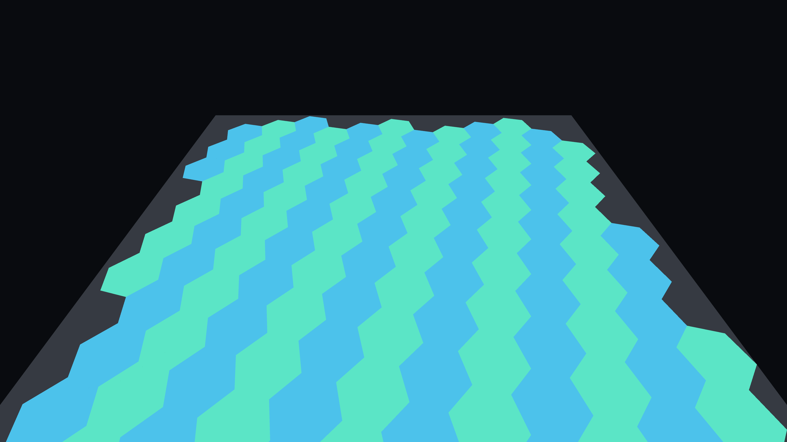
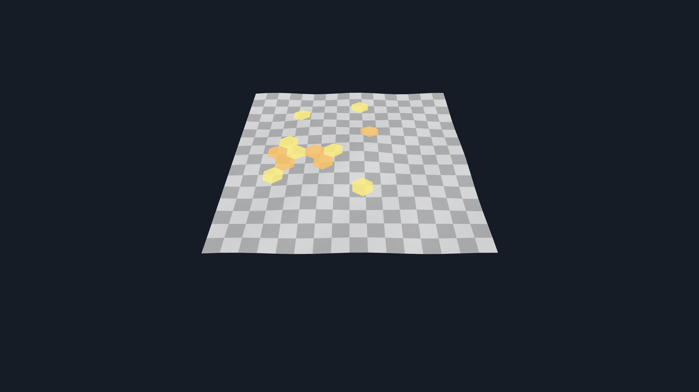
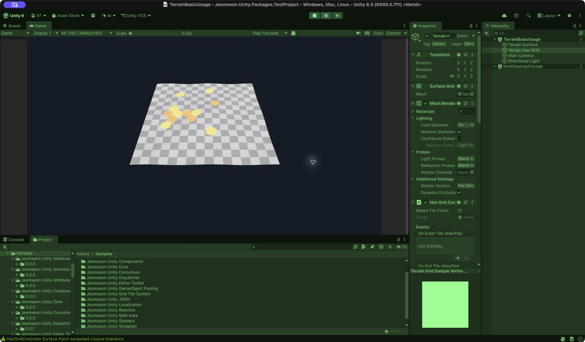

# Jeomseon Unity Grid Tile System

> 다음 릴리스의 intrinsic Surface Grid 구조는 기존 Projector 기반 Scene과 호환되지 않습니다. 새
> `HexGridController` 구성으로 다시 Bake해야 합니다.

Triangle topology와 intrinsic Surface Space 위에 육각 Grid를 생성하는 Unity 패키지입니다. Grid를
월드 XZ 또는 Projector 평면에서 투영하지 않으므로 벽, 접힌 Mesh와 곡면을 topology를 따라 다룹니다.
Surface 외곽에서는 육각형 전체가 포함되는 Tile만 유지하므로 잘린 경계 Tile을 만들지 않습니다.

## 요구 사항

- Unity 6000.5.7f1 이상
- Runtime topology 생성에 Read/Write Enabled인 Static Mesh 또는 `TerrainData`
- 원본 Mesh와 같은 Mesh를 사용하는 MeshCollider 또는 같은 TerrainData의 TerrainCollider
- OpenUPM Scoped Registry의 `com.jeomseon.unity` 스코프

Projector, URP, HDRP 또는 별도 Shader 패키지에 의존하지 않습니다.

## 설치

Unity Package Manager에서 `com.jeomseon.unity.grid-tile-system`을 추가합니다.

## 기본 구성

1. `HexGridSettings` asset을 생성합니다.
2. Scene의 readable Static Mesh 또는 Terrain에 대응하는 Collider를 둡니다. 별도 Surface 등록은 없습니다.
3. `HexGridController`의 Transform 또는 `Seed Anchor`/`Seed Offset`으로 월드 seed 위치를 정합니다.
4. 시각화가 필요하면 Grid 출력 전용 `MeshFilter`와 `MeshRenderer`를 함께 연결합니다.
5. `Rebuild Tiles`를 실행합니다. 시스템이 seed 주변 Surface를 찾고 맞닿은 Surface까지 자동 확장합니다.

Output 두 참조를 모두 비우면 논리 타일·피킹·상태만 사용하는 logical-only Grid로 동작합니다. 하나만
지정한 구성은 거부합니다. `HexGridSettings`의 `Seed Search Radius`, `Surface Layer Mask`,
`Preferred Surface Direction`은 재사용 가능한 seed 후보 선택 정책입니다. Controller의
`Initial Direction`은 Scene 배치에 종속된 첫 Hex 꼭짓점의 월드 방향을 정합니다.

`HexTileData`는 좌표·속성·색상·활성 상태만 담고, `HexTile`은 이 데이터에 UnityEvent 상호작용을
결합합니다. 저장이나 네트워크 변환은 `HexTile.Data`를 기준으로 하고, 데이터를 직접 수정한 뒤에는
필요한 시점에 `HexGridController.RefreshRendering()`을 호출합니다.

```text
Static Mesh/Terrain Adapter → Triangle topology → Triangle Unfolding local Patch
→ intrinsic Hex → Triangle/Hex clipping → barycentric Surface Region
→ pipeline-independent Geometry snapshot → Mesh Render Backend
```

색상과 활성 상태는 vertex color/alpha로 전달됩니다. Material이 vertex color를 어떻게 표현할지는
Material 또는 향후 파이프라인별 Backend가 결정합니다.



위 이미지는 Unity 6000.5.7f1의 현재 `Basic Usage` Sample을 Play Mode에서 직접 캡처한 결과입니다.
Tile 반경 0.5에서 완전한 Hex 126개가 생성됐고 Surface 외곽에서 잘린 Tile은 제외됐습니다.



`Terrain Usage`는 virtual topology로 149 Tile을 만들며 Terrain을 Mesh로 복제하지 않습니다. 출력
offset 0과 패키지 내장 depth-bias Material로 실제 Geometry를 띄우지 않고 Terrain LOD 충돌을 보정합니다.



Inspector에서는 `Surface Grid` 출력 Mesh, Renderer, `Hex Grid Controller`의 Bake 결과와 이벤트를 한
오브젝트에서 확인할 수 있습니다. Surface를 별도로 등록하는 Receiver 필드는 존재하지 않습니다.

## 정확도와 대규모 Grid API

`SurfacePatchBuildSettings`의 `SplitWhenLimitReached`를 켜면 Triangle 수 또는 graph intrinsic 반경
한계에서 만난 Face를 다음 Patch seed로 이어갑니다. Patch는 frontier의 실제 펼침 배치를 공유하므로
모두 같은 intrinsic 좌표계에 있고, `SurfaceGridBuilder`는 전체 Patch의 부분 Region을 합쳐 하나의
Logical Grid를 만듭니다. Face는 Patch 사이에 중복 배정되지 않습니다. `SurfacePatchSet`과 각 Patch의
closure error, graph geodesic 상한, 최대/평균 metric distortion으로 분할 결과를 진단할 수 있습니다.
`HexGridSettings`의 `Split Patch When Limit Reached`는 기본으로 활성화돼 같은 정책을 사용합니다.

`SurfaceGridSnapshot.Diff`는 버전 간 추가·제거·binding 변경 좌표를 반환합니다.
`SurfaceGridChunk.CollectDirty`와 `SurfaceGridChunkGeometryBuilder`를 조합하면 영향받은 Chunk만 다시
생성할 수 있습니다. `SurfaceBindingEvaluationJob`은 준비된 연속 topology/barycentric 배열의 위치와
법선을 Burst worker에서 평가하며, Unity Object 조회와 NativeArray 수명은 호출자가 Job 밖에서
관리합니다.

기본 표현은 계속 `MeshSurfaceGridRenderBackend`입니다. 선택적
`StructuredBufferSurfaceGridRenderBackend`는 vertex/index/visual을 GPU buffer에 올리고 indexed
indirect draw를 제출합니다. Material은 `_SurfaceGridVertices`와 `_SurfaceGridVisuals` 계약을 구현해야
하며, URP/HDRP 전용 통합은 이 Core 패키지에 포함하지 않습니다.

`TangentExpMapSurfaceParameterizer`는 seed 접평면 1차 log-map 비교 기준선입니다. 완전한 heat-method
geodesic solver가 아니며, `SurfaceParameterizationComparison`으로 Triangle Unfolding과 Patch 수·최대
metric distortion을 같은 입력에서 비교해 정책을 선택합니다.

## 현재 제한 사항

- Runtime Adapter는 readable Static Mesh와 Terrain heightfield를 지원합니다. Terrain은 전체 Mesh를
  복제하지 않고 vertex/triangle/adjacency를 계산하며 hole Face는 traversal에서 제외합니다.
- Skinned Mesh는 단일 Surface Grid에서 bone 변형을 따라갑니다. 여러 Surface에 걸친 Grid는 Surface별
  변형 규칙을 하나의 binding으로 합치지 않으므로 bind pose 표현에 머뭅니다.
- 곡률이 큰 영역은 자동 다중 Patch로 나눌 수 있지만 구면 전체의 regular hex topology defect를
  제거하지는 않습니다. 현재 graph geodesic은 Face 중심 adjacency 누적 상한이며 heat method가 아닙니다.
- GPU Backend는 범용 structured-buffer/indirect 계약만 제공합니다. Terrain heightmap compute 생성과
  파이프라인별 Shader/Pass는 실제 프로젝트 수요가 확인될 때 별도 통합 패키지로 확장합니다.
- structured-buffer Backend의 skinned deformation은 interleaved buffer 전체를 재업로드합니다. 정점 수가
  큰 동적 Surface에서는 Burst 평가와 Chunk 분리를 함께 사용해야 합니다.
- 입력은 Unity Input System과 MeshCollider/TerrainCollider raycast를 사용합니다.

수학 학습 순서는 Harness의 `architecture/intrinsic-surface-grid-study-guide.md`에 정리돼 있습니다.

영문 문서는 [README.en.md](README.en.md)를 참고하세요.
